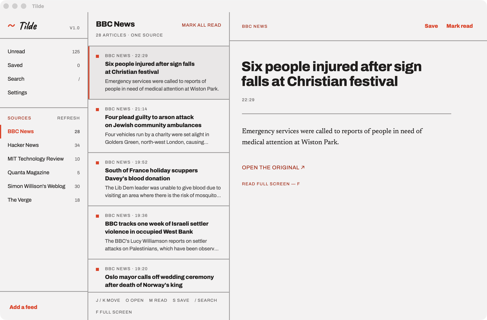

# Tilde

### All the sites you read. In one place.

**A free RSS reader with no account.** Tilde collects new posts from the blogs, news sites
and newsletters you pick — and nothing else. No ads, no algorithm, no suggestions.
Everything you read stays on your own device.

[**⬇ Download for Mac**](https://github.com/KshitijKoranne/Tilde-RSS-Reader/releases/latest) · [**Open in your browser**](https://tilde-rss-reader.vercel.app)

Universal — Apple silicon and Intel · macOS 10.15+ · 4.4 MB · free

---

## Why you might want it

**You actually finish.** Most readers scroll forever. Tilde shows what is new since you last
looked, and once you have read it the list is empty and says so. The unread count goes down
and only down. Nothing refills it to keep you busy.

**You choose what shows up.** Paste any site's address — Tilde finds the feed itself — or bring
your whole list from another reader as one OPML file, folders and all. Your feeds are never
reordered and nothing is ever slipped in.

**You can find it again.** Every article you open is kept in full, on your own machine. Search a
half-remembered phrase months later and it is still there, even if the site that published it is
gone — and it comes back as fast in year three as it did in week one, because Tilde searches an
index of your archive rather than reading the whole thing.

**Nobody is watching.** No account to create, no analytics, no trackers, no server holding your
reading list. Remote images are off by default, because images carry trackers.

**You can read what the feed won't give you.** Some sites publish a sentence and a link; Hacker
News publishes only the link. Press **Read the full article** and Tilde fetches the page and
pulls the article out of it — the same reader mode your browser has, without leaving Tilde.
Only when you ask, never on its own.

**It is quick.** One key for everything, and it opens and reads with the network off.

---

## The Mac app

The same reader, in your Dock — one small Rust binary around a native web view, under 9 MB
installed. Three things it does that the browser cannot:

- **No proxy, ever.** On the web, a browser is forbidden from requesting a third-party feed, so
  requests pass through this project's own function. The Mac app asks each source directly.
  Your reading list touches no server at all.
- **Nothing to go stale.** No service worker, no cache to fail — the app is a file on your disk.
  It opens offline because that is the only way it opens.
- **Older feeds read correctly.** It honours a feed's declared character set, so a decade-old
  blog arrives as words rather than question marks.

### Opening it the first time

Apple charges $99 a year for the account that signs Mac software. There isn't one behind Tilde,
so macOS cannot tell you who built it and will warn you. **The warning is about a missing
signature, not about anything the app does.**

Drag Tilde to Applications, then **right-click it → Open**, and Open again. If macOS refuses
outright, go to **System Settings → Privacy & Security**, scroll to the note about Tilde, and
press **Open Anyway**. Once, not every launch.

---

## Keyboard

| Key | |
|---|---|
| `j` / `k` | Next, previous article |
| `o` | Open in the reader |
| `m` | Mark read or unread |
| `s` | Save for later |
| `/` | Search everything you have read |
| `a` | Add a feed |
| `r` | Refresh every source |
| `f` | Full-screen reading |
| `Esc` | Leave full screen, close a dialog |

---

## Good to know

**A new install subscribes to nothing.** It opens on a picker of 18 widely-read feeds across
News, Technology, Science, Programming and Writing — and makes zero network requests until
you choose one.

**Sources can live in groups.** Give a source a group in Settings and it folds up under that
name in the sidebar, with its own unread count; click the name to read just that group. Groups
are only ever a name a source carries, so there is nothing to create, order or tidy up.

**Your feeds are yours.** OPML in and out from Settings, the same format every other reader
speaks — including the folders, which arrive as groups and leave as folders again. Nothing
locks you in.

**You decide how much is kept.** The archive keeps everything by default. If you would rather
it did not grow forever, Settings will let go of articles past three months, six months or a
year — once you have read them. Anything you saved stays, whatever its age.

**Web and Mac don't sync.** There's no account to tie them together and no server holding your
list — that's the point. Move feeds across with OPML. Read state and the local archive stay per
install.

**Where it lives.** In the browser, IndexedDB under the origin; clearing site data deletes it all.
On the Mac, `~/Library/WebKit/in.kjrlabs.tilde` — macOS keeps that when you trash the app, so
delete it too for a clean uninstall.

<b>A little more, for the curious</b>

 

React and TypeScript, no framework beyond the router. Feeds are parsed in the client — RSS 2.0,
Atom 1.0 and RDF — and passed through an allowlist sanitiser before anything is rendered, so
hostile markup in a feed never reaches the page. Articles and settings live in IndexedDB.

The archive is arranged for the fact that it only grows. Article records are small and are held
in memory all at once; their text is kept in a table of its own and read when you open one. Every
article's text is reduced to its terms as it is stored, so searching reads an index of the words
you asked for rather than a year of reading — a phrase is then confirmed against the few
likeliest articles, which is why searching for *the long now* does not return everything
containing *the*.

The web build has exactly one piece of server code: `api/feed.js`, a byte proxy that exists only
because CORS forbids the direct request. It keeps no log. The Mac build is the same bundle
inside a [Tauri 2](https://tauri.app) window, where four Rust commands replace that proxy
entirely — the parser, the sanitiser, the store, every component and stylesheet run unmodified
in both.

Verified against reality rather than assumed: all 18 suggested feeds fetched and parsed live;
the sanitiser held against ten hostile inputs; the proxy refuses `localhost`, link-local and
private address ranges; 66 end-to-end browser assertions including offline boot and a first run
that makes zero network requests.

`npm test` runs the suite — 140 tests over the parsing, sanitising and storage layer, which is
where input from the open web arrives and where your archive lives. It covers the sanitiser
against hostile markup, all three feed formats, OPML round trips, the search index, and the
upgrade that moves an existing archive to the current storage layout without losing an article.

Built from the [Claude Design](https://claude.ai/design/p/680e868d-d6bc-45da-974f-39fdf18818bb)
project *Tilde RSS reader design*.

---

MIT licensed. Made by [KJR Labs](https://kjrlabs.in).

